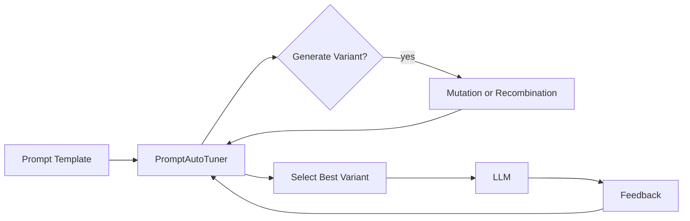

---

author: DevSynth Team
date: '2025-07-23'
last_reviewed: '2025-07-23'
status: draft
tags:
- technical-reference
- prompts
- tuning
title: Prompt Auto-Tuning Framework
version: "0.1.0a1"
---
<div class="breadcrumbs">
<a href="../index.md">Documentation</a> &gt; <a href="index.md">Technical Reference</a> &gt; Prompt Auto-Tuning Framework
</div>

# Prompt Auto-Tuning Framework

DevSynth includes a prompt auto-tuning system that evolves prompt templates based on usage feedback.

## Diagram



*Implementation status: Core tuning algorithms and variant tracking are implemented with unit tests.*

## Pseudocode Example

```python
from devsynth.application.prompts.auto_tuning import PromptAutoTuner

TEMPLATE = "Review the following code:\n{code}"

# Initialize tuner and register template
 t = PromptAutoTuner()
 t.register_template("code_review", TEMPLATE)
 variant = t.select_variant("code_review")
 response = llm.generate(variant.template)
 t.record_feedback("code_review", variant.variant_id, success=True, feedback_score=0.9)
```

This iterative process refines prompts over time and selects high performing variants.
