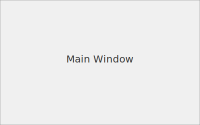
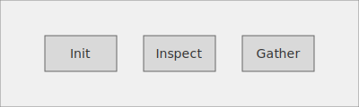
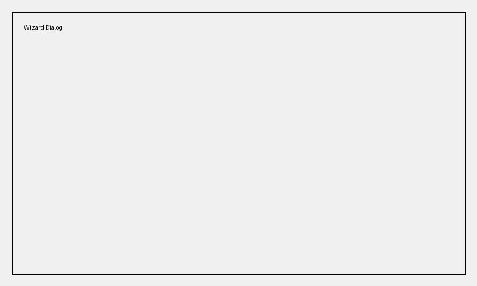
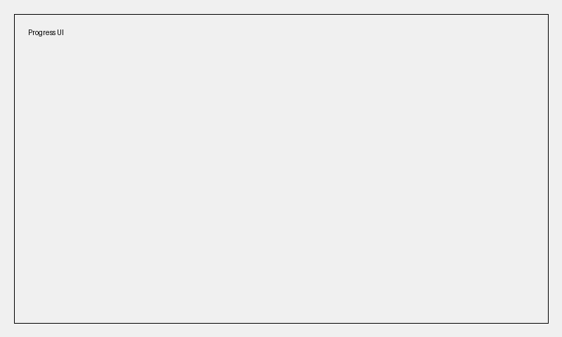

<div class="breadcrumbs">
<a href="../index.md">Documentation</a> &gt; <a href="index.md">User Guides</a> &gt; Dear PyGui User Guide
</div>

# Dear PyGui User Guide

The Dear PyGui interface provides a lightweight desktop client for DevSynth. It shares workflow logic with the CLI through the [UXBridge abstraction](../architecture/uxbridge.md), allowing commands to be reused across interfaces.

## Installation

Install the `gui` extra to pull in Dear PyGui and run the interface module:

```bash
poetry install --extras gui
poetry run python -m devsynth.interface.dpg_ui
```

## Using the GUI

Launching the module opens a window that mirrors the DevSynth CLI. Every
available command is exposed as a button. Clicking a button runs the same
workflow as the CLI while displaying a modal progress dialog. Commands that
require additional input present wizard-style forms that guide you through the
necessary steps.

Long‑running operations update the progress bar automatically so you can track
completion without blocking the interface. Errors are reported in modal
dialogs, allowing you to retry or inspect the output.

## Command Mapping

The table below shows how common CLI commands map to Dear PyGui actions.

| CLI Command | Dear PyGui Action |
|-------------|------------------|
| `init`      | **Init** button |
| `inspect`   | **Inspect** button |
| `gather`    | **Gather** button |

For a full mapping of commands across interfaces, see the [CLI to WebUI and Dear PyGUI Command Mapping](../architecture/cli_webui_mapping.md).

## MVUU Dashboard

Launch the MVUU traceability dashboard to explore commit links:

```bash
devsynth mvuu-dashboard
```

The dashboard uses NiceGUI to visualize traceability information.

Enable the dashboard and desktop client by setting feature flags in your configuration:

```yaml
features:
  gui: true
  mvuu_dashboard: true
```

## Screenshots





## Dialogs and Feature Flags

### Requirements Wizard

Use the **Wizard** button to launch a step-by-step dialog for capturing project requirements. Each step collects information and shows a progress indicator so you can track completion.



### Progress Dialog

Long-running commands display a modal progress window that can be cancelled if needed. This dialog is reused across operations to provide feedback without blocking the interface.



### Enabling Features

The wizard and progress dialogs are guarded by the `experimental` feature flag. Enable it with:

```bash
devsynth enable-feature experimental
```

or add the flag directly in your configuration:

```yaml
features:
  experimental: true
```

Refer to the [Configuration Reference](configuration_reference.md#feature-flags) for details on managing feature flags. These dialogs were introduced in the [0.1.0-alpha.1 milestone](../roadmap/release_plan.md#010-alpha1) and will evolve as the release plan progresses.
