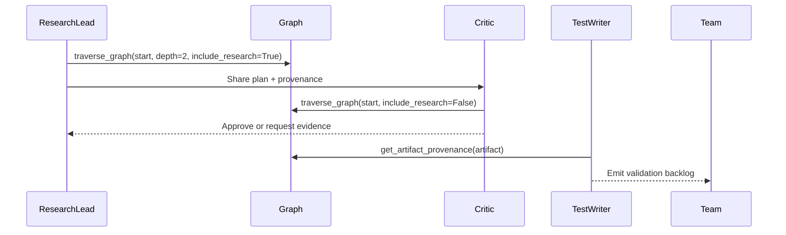

# WSDE Specialist Roles and Dialectical Responsibilities

## Overview

DevSynth's WSDE research cell rotates three specialised personas to maintain a
multi-disciplinary, dialectical posture:

- **Research Lead** – poses Socratic questions, assembles graph traversal
  context, and ensures Autoresearch artefacts cite the correct upstream nodes.
- **Critic** – challenges the plan by replaying the traversal without research
  overlays, verifying `supports` / `derivedFrom` links, and flagging missing
  evidence.
- **Test Writer** – converts approved artefacts into executable validation tasks
  tied to the same provenance metadata.

Each persona interacts with `EnhancedGraphMemoryAdapter.traverse_graph()` to
stay bounded, and references `get_artifact_provenance()` to surface `hasRole`
relationships during reviews.

## Dialectical Loop

## CLI and Dashboard Touchpoints

- `devsynth ingest --research-artifact` now logs `supports`, `derivedFrom`, and
  `hasRole` metadata for every stored artefact.
- The MVUU dashboard surfaces a "Knowledge Graph Provenance Snapshot" section
  that lists each artefact, its supported nodes, upstream references, and the
  roles accountable for the evidence trail.
